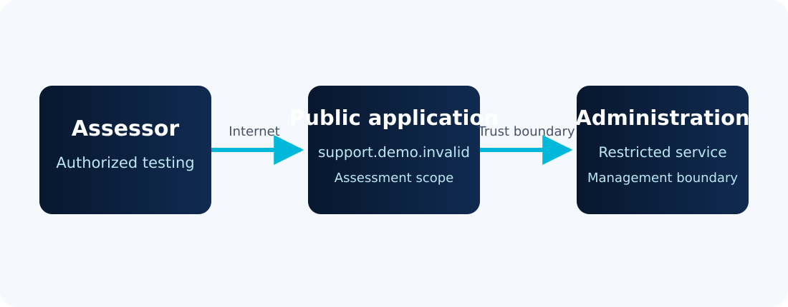

## Statement of Confidentiality

This fictional report is provided solely to demonstrate ReportKit. Northstar
Widget Company, its systems, people, and results are invented. No real client
or certification assessment material is included.

## Executive Summary

Northstar Widget Company commissioned a focused assessment of its fictional
customer-support application. Testing identified two validated weaknesses. An
internet-accessible administrative console retained its vendor default
credential, while verbose error responses disclosed internal implementation
details.

The default credential creates the more credible attack path because it grants
an unauthenticated external party administrative control. Northstar should
rotate that credential immediately, restrict the console to its management
network, and require multifactor authentication. Error handling should then be
standardized so that clients receive a generic reference code while diagnostic
detail remains in access-controlled server logs.

### Assessment Result

| [Critical]{.sev .sev-critical} | [High]{.sev .sev-high} | [Medium]{.sev .sev-medium} | [Low]{.sev .sev-low} | Total |
|:---:|:---:|:---:|:---:|:---:|
| 0 | 1 | 1 | 0 | **2** |

| ID | Severity | Finding | Affected Asset |
|---|---|---|---|
| F-001 | [High]{.sev .sev-high} | Default Administrative Credential | `support.demo.invalid` |
| F-002 | [Medium]{.sev .sev-medium} | Verbose Error Responses | `support.demo.invalid` |

## Engagement Overview

### Scope

| Asset | Description |
|---|---|
| `support.demo.invalid` | Fictional customer-support application |
| `198.51.100.24` | Documentation-only address reserved for examples |

The assessment was limited to the listed application. Denial-of-service
testing, social engineering, and access to third-party services were excluded.

### Methodology

Testing combined service discovery, manual authentication review, session and
authorization testing, input validation checks, and bounded verification of
identified weaknesses. Findings were included only when their behavior and
impact could be reproduced.

### Risk Rating

Severity reflects likelihood and demonstrated business impact in the fictional
environment:

- **Critical:** immediate, broad compromise with severe organizational impact.
- **High:** practical compromise of sensitive systems or data.
- **Medium:** meaningful weakness requiring additional conditions or having
  constrained impact.
- **Low:** limited direct impact or defense-in-depth weakness.

## Architecture

The simplified diagram shows the assessed trust boundary and the intended
separation of the public application from administrative functions.

